# Quick User Guide

A quick showcase of all functionality. This feature is based on [git-blame](https://git-scm.com/docs/git-blame).

ℹ️ The line author view only works in Live-Preview and Source mode - not in Reading mode.

ℹ️ Currently, only Obsidian on desktop is supported.

ℹ️ The recently released Obsidian v1.0 is fully supported. The images and GIFs in this document are however not yet updated.

## Activate

It can also be activated via Command Palette `Git: Toggle line author information`.

## Default line author information

Shows the initials of the author as well as the authoring date in `YYYY-MM-DD` format.

The `*` indicates, that the author and committer (or their timestamps) are different - i.e., due to a rebase.

## Commit hash and full name

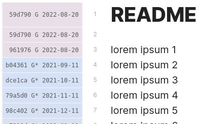

via config

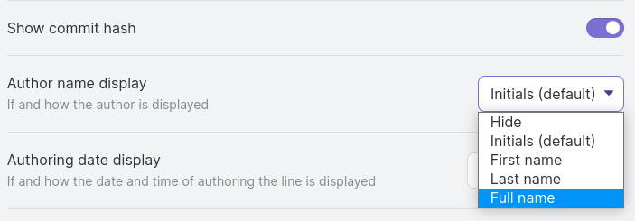

## Natural language dates

## Custom date formats

via config

## Commit time in local/author/UTC time-zone

**UTC+0000/Z**

The simplest option to start with is showing the time in `UTC+00:00/Z` time-zone.
This is independent of both your local and the author's time-zone.
It is shown with a suffix `Z` to avoid confusion with local time.

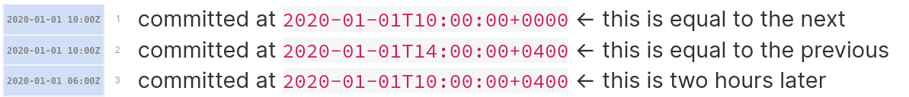

This is the time displayed in the guter is the same for all users.

**My local (default)**

By default, the times are shown in your local time-zone - i.e., `What was the clock-time at my wall showing, when the commit was made?` This depends on your local time-zone. For instance, this is the view for a user in the `UTC+01:00` time-zone.

Note, how the displayed time is `1h` ahead of the above `UTC+0000` time.

**Author's local**

Alternatively, it can show it in the author's time-zone with explicit `UTC` offset - i.e., `What was clock-time at the author's wall and their explicit UTC offset, when the commit was made?`

This is independent of your local time-zone and the same time is displayed for all users.

**Configuration**

## Age-based gutter colors

The line gutter color is based on the age of the commit. It adapts to the dark/light mode automatically.

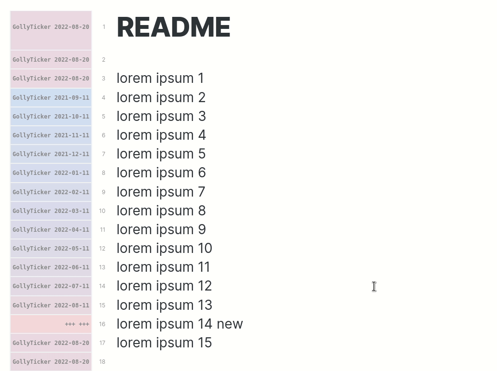

Red-ish means newer and blue-ish means older. All commits at and above a certain maximum coloring
age (configurable; default `1 year`) get the same strongest blue-ish color.

The colors are configurable and the defaults are chosen to be accessible.

## Adjust text color CSS based on theme

By default, the gutter text color uses `var(--text-muted)` which
is whatever is defined by your theme. You can however, change it to a different CSS
color or variable.

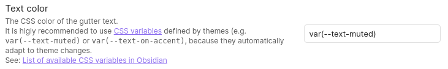

Example:
| `var(--text-muted)` | `var(--text-normal)` |
|----------------------------------------------|-----------------------------------------------|
| 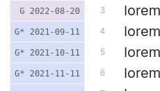 | 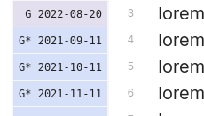 |

## Copy commit hash

## Quick configure gutter

## New/uncommitted lines and files show `+++`

## Follow lines across cut-copy-paste-ing within same commit / all commits

By default, each line shows the last commit, where it was changed.
This means, that cut-copy-paste-ing lines will show the new commit,
even though it was not originally written in that commit.

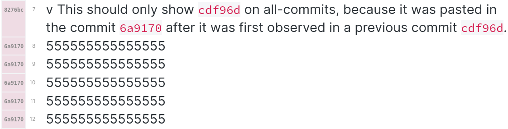

However, if for instance following is set to `all commits`, then this is the result:

Configuration:

## Soft and unintrusive ansynchronous view updates

Since computing the line author information takes time (due to a `git blame` shell invocation)
the result appears delayed. To minimize distraction and improve user experience,
the view is updated in a soft and unintrusive manner.

When opening a file, a placeholder is shown meanwhile:

While editing, a placeholder is shown as well until the file is saved and the line author information is computed.

## Multi-line block support

The markdown rendering of multiple lines as a combined block is also supported.
In this case the newest of all lines is shown in the gutter.

## Ignore whitespace and newlines

This can be activated in the settings.

| **Original**                                         | **Changed with preserved whitespace**                   | **Changed with ignored whitespace**                   |
| ---------------------------------------------------- | ------------------------------------------------------- | ----------------------------------------------------- |
| 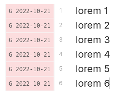 | 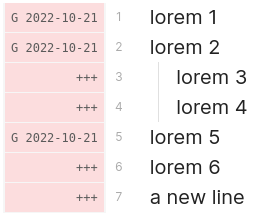 | 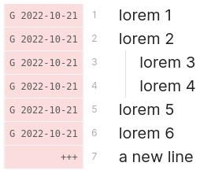 |

Note, how ignoring the whitespace does not mark the indented
lines as changes, as only additional whitespace was added.

## Submodules support

Line author information is fully supported in submodules.
